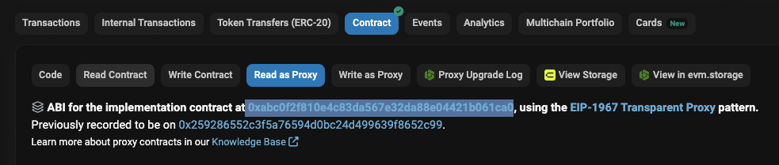

# Permission Scanner

The permission scanner allows scanning a DeFi protocol, or any smart contract system, for permissioned functions. It returns a list of the smart contracts, the identified permissioned functions and respective permission owners.

## How it works

In order to scan a protocol for permissioned functions, the target protocol is specified in terms of the chain and a set of addresses of all deployed contracts. These contracts all have to be verified on a public block explorer. You can find a list of supported chains and explorers [here](#supported-chains). The permission scanner then downloads the source code of the contracts from the explorer, scans these for permissions, reads the permission owner from the respective storage slot, and writes the results in an output file.

## Prerequisites

- Python3 installed on your machine
- `solc` compiler
- A valid Etherscan API key (see env variables)
- A valid RPC api key, e.g Infura or Alchemy (see env variables)

## Getting started

Create and activate a virtual Python environment, and install the required Python packages with

```shell
python3 -m venv venv
source venv/bin/activate
pip install -r requirements.txt
```

Copy the `.env.example` file to `.env` and, depending on the network where the contracts are deployed on, fill in your RPC provider's url and a valid block explorer api key. Then load the variables with

```shell
source .env
```

Create a file called `./contracts.json` with the chain name, project name and addresses of all contracts of the protocol. Find a list of supported chains [here](#supported-chains). See an existing `example` at `./example/contracts.json` on how to specify the input for the scanner.

> See an existing `example` at `./example/contracts.json` on how to specify the input for the scanner

> Note in the `contracts.json` file the contract names have to exactly match otherwise the contracts are not included in the output successfully.

> If one contract is a proxy, please also specify the implementation contract name to compile the output, the implementation contract address is not required.

Example:

```json
{
  "name": "ERC1967Proxy",
  "implementation_name": "VaultManagerV5",
  "address": "0xb62bdb1a6ac97a9b70957dd35357311e8859f0d7"
}
```

The name of the implementation contract can be retrieved e.g on etherscan, when clicking on the address of the implementation and check the contracts tab of this.



Then execute the scanner script with

```shell
python src/main.py
```

Note, if you don't have the correct `solc` compiler version, it will be installed automatically by the script with `solc_select`.

The script will write the results of the scanner in a new file `./permissions.json`. See an existing example in the example folder.

Once you have your analysis completed, you can deactivate the Pyhton environment again with the following command

```shell
source deactivate
```

## Supported Chains

To match `contracts.json` chain field `"Chain_Name"`, check `get_rpc_url.py`. Make also sure to include a valid rpc url in the .env file.

## Limitations

The permission scanner does NOT guarantee that the provided set of contract addresses is complete, or that the contracts in fact are part of the protocol.

Permissions are identified by the usage of `onlyOwner` modifiers or `msg.sender` checks in a contract function. Other forms of permissions may exist that are not captured with this approach.

The permission scanner attempts to read permission owners from contract storage directly. This can fail, in particular if a contract uses an upgradeability pattern, and should be manually verified.

The permission scanner _only_ identifies permissions and their owners but does not assess the impact or risks of such permissions.

## Acknowledgements

The permission scanner is built on the Slither [static analyzer](https://github.com/crytic/slither). We thank the [Trail of Bits](https://www.trailofbits.com/) team for creating this open-source tool and all the work they have done for the security in the DeFi sector.
